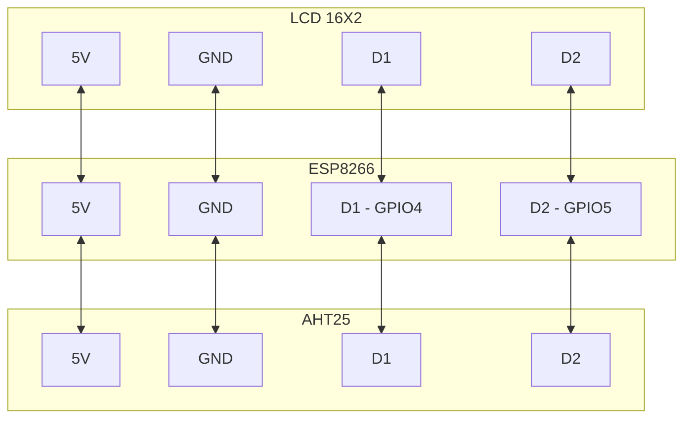

#### Temperature Monitoring 
- I2C 16X2 LCD 
- AHT25 Humidity and Temperature Sensor
- Since both supports and usages I2C protocol, Same pin configuration can be used for both

```mermaid
graph TD

    A <--> I
    B <--> J
    C <--> K
    D <--> L

    E <--> A
    F <--> B
    G <--> C 
    H <--> D


    subgraph LCD 16X2

    E[5V]
    F[GND]
    G[D1]
    H[D2]
  
    end

    
    subgraph ESP8266

    A[5V]
    B[GND]
    C[D1 - GPIO4]
    D[D2 - GPIO5]

    end


    subgraph AHT25

    I[5V]
    J[GND]
    K[D1] 
    L[D2]
  
    end
```
